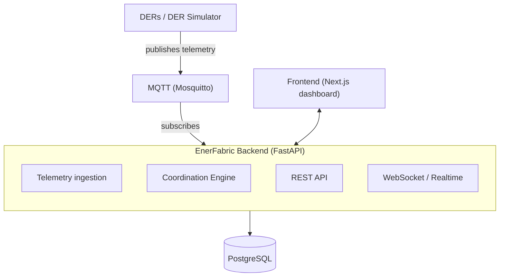
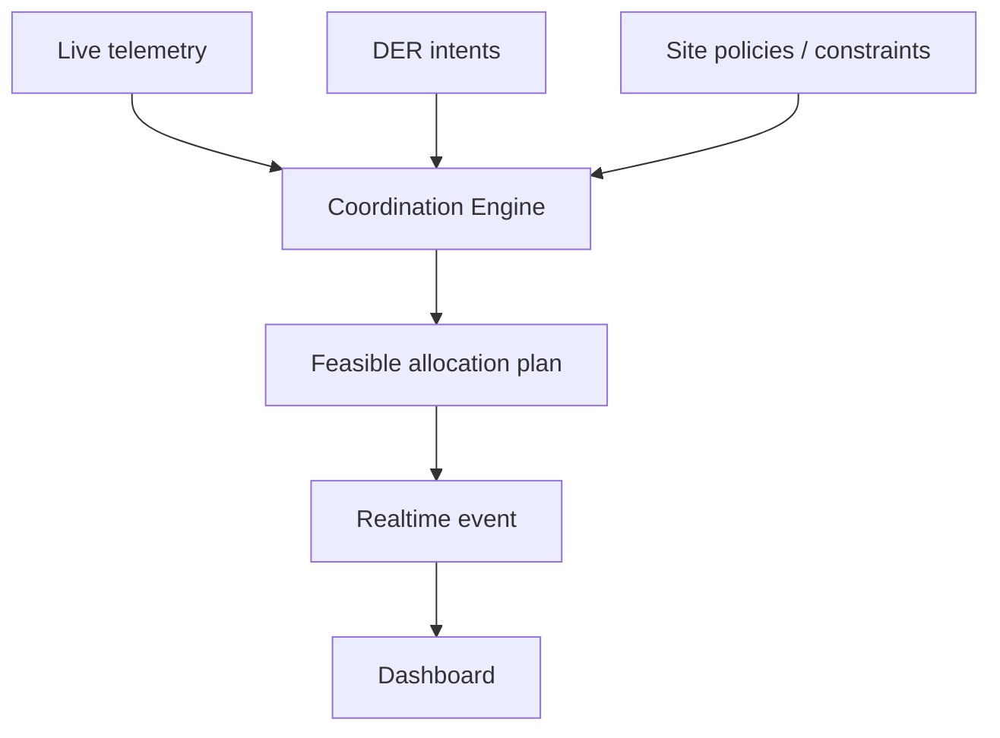
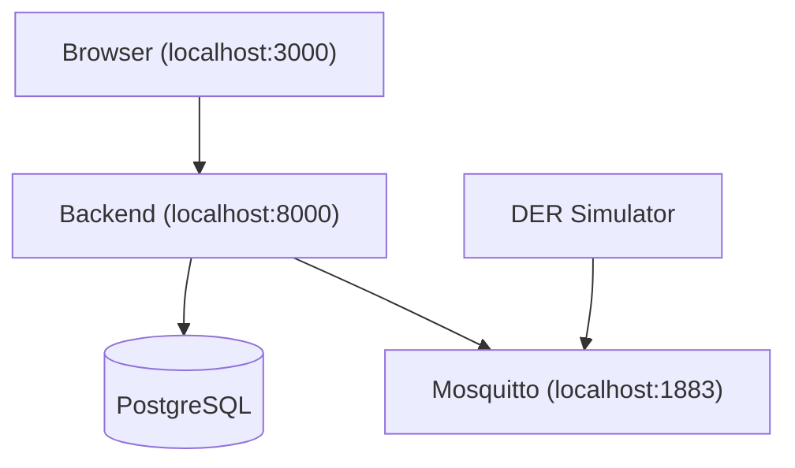

# EnerFabric Architecture

A high-level look at how EnerFabric is put together. For setup and
run instructions, see [README.md](./README.md).

## 1. High-level system architecture

The backend is a single modular FastAPI application. DER telemetry
arrives over MQTT and is ingested, persisted to PostgreSQL, and made
available both through the REST API and as live WebSocket events. The
frontend never talks to PostgreSQL or MQTT directly — it only talks to
the backend.

## 2. Core data / decision flow

This is the flow that makes EnerFabric an orchestration platform
rather than a monitoring dashboard: it doesn't just show state, it
turns state into a decision.

- **Live telemetry** — each asset's current power, state of charge,
  and availability.
- **DER intents** — what each asset needs or prefers (e.g. "charge to
  80% before 7am", "maintain 30% reserve").
- **Site policies / constraints** — system-wide rules (e.g. protect
  critical loads, limit grid import, prefer renewables).
- **Coordination Engine** — combines all three, deterministically, into
  a **feasible allocation plan**: what each asset should do this cycle,
  and why.
- The resulting plan is persisted, broadcast as a realtime event, and
  reflected on the dashboard — so the same decision is visible to every
  connected client without a manual refresh.

## 3. Component overview

- **Frontend** — a Next.js + TypeScript dashboard. Fetches state over
  REST and subscribes to a WebSocket for live updates; renders assets,
  intents/policies, coordination decisions, and impact.
- **Backend** — a FastAPI application that owns telemetry ingestion,
  the REST API, and realtime broadcast, and orchestrates the
  coordination engine against persisted state.
- **Coordination Engine** — a deterministic, side-effect-free function
  that evaluates current telemetry, active intents, and site policies
  together and produces a feasible, explainable allocation plan.
- **PostgreSQL** — the system's persistent state: assets, telemetry
  history, intents, policies, and coordination runs.
- **MQTT / Mosquitto** — the transport DER telemetry arrives over,
  decoupling device data producers from the backend.
- **DER Simulator** — a deterministic local stand-in for real devices
  (solar, battery, EV charger, flexible/critical loads, grid), used to
  generate realistic telemetry for development and demos.
- **WebSocket** — pushes telemetry updates and completed coordination
  runs to every connected client in real time.

## 4. Runtime / local deployment view

Locally, PostgreSQL and Mosquitto are internal infrastructure services
— the frontend never connects to them directly. The browser talks only
to the backend (REST + WebSocket on `:8000`); the backend is the sole
client of PostgreSQL and the sole subscriber to Mosquitto. The DER
simulator publishes telemetry to Mosquitto the same way a real device
gateway would.
