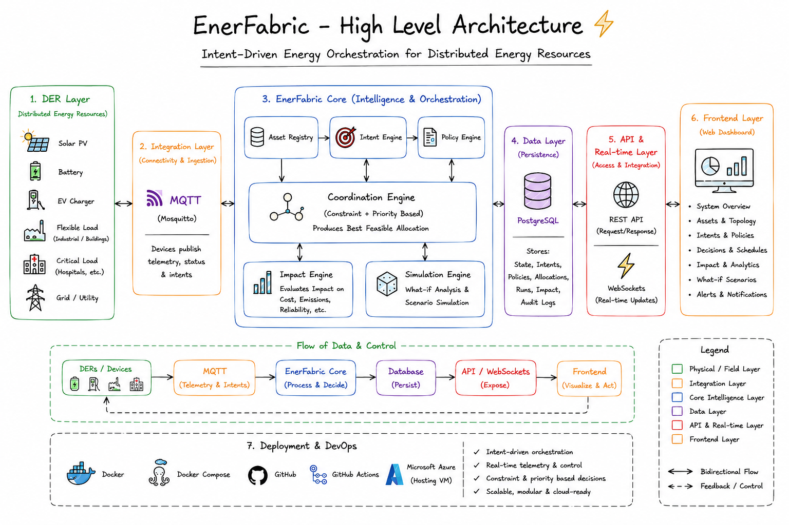

# EnerFabric

**Intent-Driven Energy Orchestration Platform for Distributed Energy Resources.**

[](infra/mosquitto/mosquitto.conf)
[](docker-compose.yml)
[](docs/deployment.md)

[](http://20.120.168.206/)
[](docs/getting-started.md)
[](https://youtu.be/-5bFhCGbilk)

Built by team **ZenYukti** for **SRCAS Hackathon 3.0**.

## What is EnerFabric?

Rooftop solar, batteries, EV chargers, and flexible/critical loads on a
site are usually already connected - each one reports its own state to
its own app. **Physical connectivity is not system-level coordination.**
None of those systems know about each other's intent, compete for the
same solar surplus or the same grid-import headroom, or explain why one
asset was favored over another.

EnerFabric sits above that connectivity layer. It combines each asset's
live telemetry, its declared **intent** (what it needs - "charge to 80%
before 7am", "maintain 30% reserve"), and site-wide policies and
constraints (protect critical loads, limit grid import, prefer
renewables) into one deterministic **[Coordination Engine](docs/coordination.md)**. Given the
current state of a fleet, it produces a feasible, per-asset allocation
plan - and a concrete explanation for every decision in it.

It is not a monitoring dashboard and not a device-connectivity layer.
The dashboard shows state; the engine decides what happens next.

## How it works



EnerFabric combines live DER telemetry, asset intent, policies,
priorities, and constraints to produce a feasible allocation.

Full component diagram and data flow:
[Architecture documentation](docs/architecture.md)

## Live Demo

**http://20.120.168.206/** - Docker Compose deployment on an Azure VM,
served over plain HTTP through nginx (no TLS configured).

## Key Components

| Component | Responsibility |
|---|---|
| Coordination Engine | Deterministic, side-effect-free function that turns telemetry + intents + policies into a feasible, explained allocation plan. |
| DER Simulator | Deterministic stand-in for real devices (solar, battery, EV charger, flexible/critical loads, grid), publishing over MQTT. |
| MQTT / Mosquitto | Transport boundary DER telemetry arrives over, decoupled from the backend's internal state. |
| Backend (FastAPI) | Owns telemetry ingestion, persistence, the REST API, and realtime broadcast; the only client of PostgreSQL and Mosquitto. |
| PostgreSQL | Persists assets, telemetry history, intents, policies, and coordination runs. |
| WebSocket layer | Broadcasts `telemetry.updated` and `coordination.completed` events to every connected client. |
| Frontend (Next.js) | Five-page dashboard - Overview, Assets, Intents & Policies, Coordination, Impact - driven entirely by the REST/WebSocket API. |
| nginx | Single public entry point in the deployed stack; routes `/` to the frontend and `/api/` to the backend. |

## Repository Structure

```
enerfabric/
├── backend/            FastAPI app: domain model, coordination engine, simulator, API, MQTT, WebSockets, DB
├── frontend/            Next.js + TypeScript dashboard
├── infra/
│   ├── mosquitto/        local MQTT broker config
│   └── nginx/            reverse proxy config for deployment
├── docs/                 detailed guides (see below)
├── docker-compose.yml    local infra + full-stack deployment
└── Makefile              common dev/deploy commands
```

## Quick Start

```bash
docker compose up -d postgres mosquitto     # local infra

cd backend && python3 -m venv .venv && source .venv/bin/activate
pip install -r requirements-dev.txt && cp .env.example .env
uvicorn app.main:app --reload               # http://localhost:8000

cd frontend && npm install && cp .env.example .env.local
npm run dev                                 # http://localhost:3000
```

Full walkthrough, including seeding assets and running the DER
simulator: **[docs/getting-started.md](docs/getting-started.md)**.

## Documentation

- **[Getting Started](docs/getting-started.md)** — local development setup, simulator, verification.
- **[Architecture](docs/architecture.md)** — components, data flow, source-code map.
- **[Coordination Engine](docs/coordination.md)** — why EnerFabric exists and how it decides.
- **[Deployment](docs/deployment.md)** — Docker Compose + Azure VM + nginx.

## Deployment

```
GitHub → Docker Compose → Azure VM → nginx (:80) → frontend + backend + Postgres + Mosquitto + simulator
```

The live demo runs the full stack - PostgreSQL, Mosquitto, backend,
frontend, the DER simulator, and nginx - as containers on a single
Azure VM, via the same `docker-compose.yml` used for local full-stack
testing. Only nginx (port 80) is publicly reachable; every other
service is bound to `127.0.0.1` on the VM. See
**[docs/deployment.md](docs/deployment.md)**.

## Project Status

**Implemented**

- Domain model, deterministic coordination engine, DER simulator (all with dedicated test suites).
- REST API + PostgreSQL persistence for assets, telemetry, intents, policies, and coordination runs.
- MQTT telemetry ingestion and WebSocket realtime broadcast.
- Full product dashboard: Overview, Assets, Intents & Policies, Coordination, Impact.
- Docker Compose deployment behind nginx, running live on an Azure VM.

**Current Limitations**

- The Impact Engine is not implemented - every `CoordinationRun.impact` is `null`; the dashboard reports this honestly rather than fabricating metrics.
- No coordination-run history endpoint - "recent runs" on the dashboard are session-local (this browser tab's own triggers plus live WebSocket events), not a durable log.
- No authentication on the API, MQTT broker, or WebSocket - acceptable for a hackathon demo, not for production.
- The live demo serves plain HTTP only - no TLS/certificate is configured.
- Single-process WebSocket broadcast - does not scale beyond one backend instance.

## Team

**ZenYukti** · SRCAS Hackathon 3.0 - 2026
