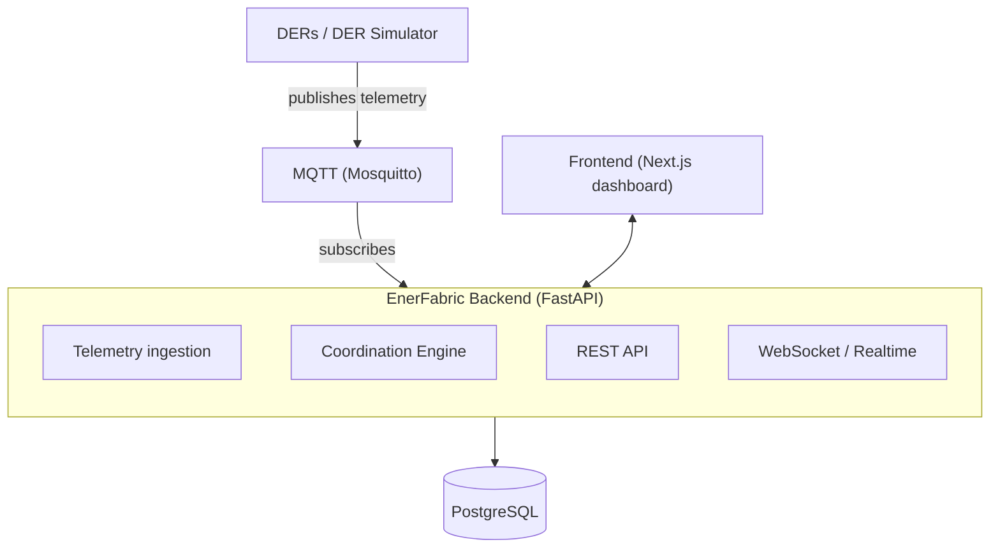
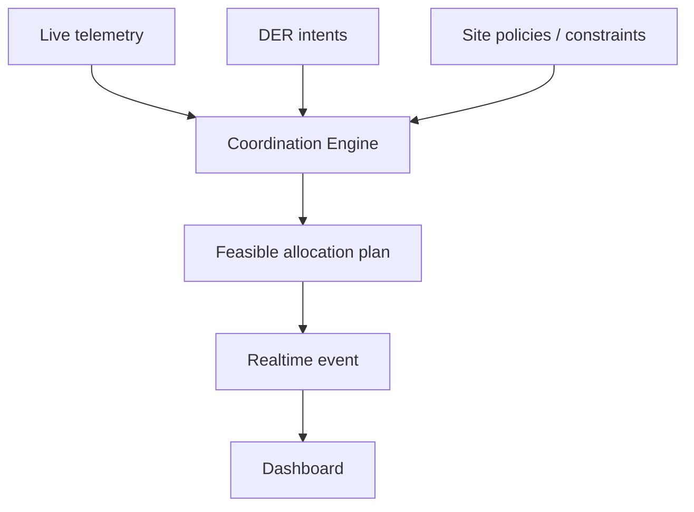
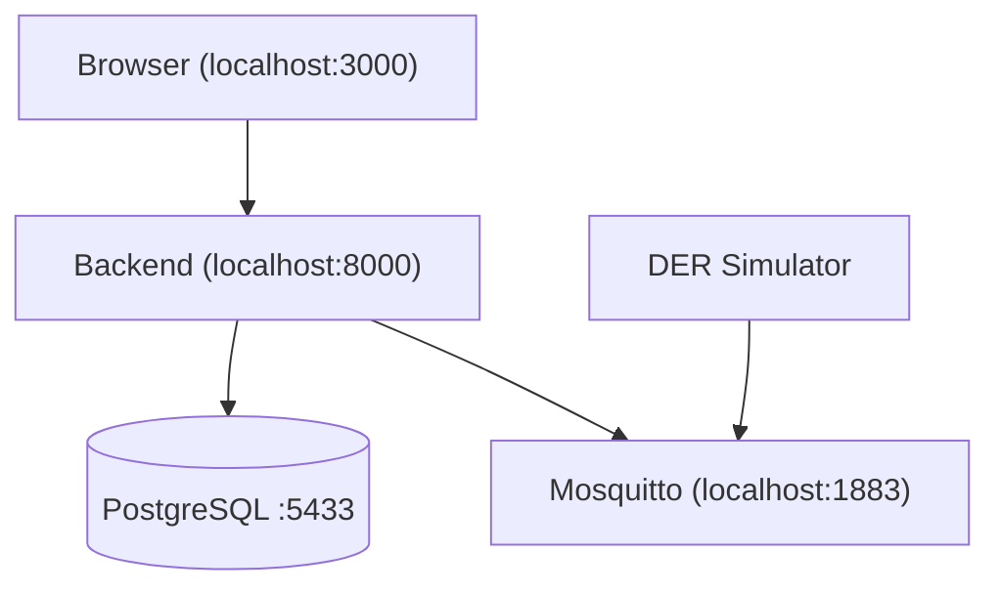

# Architecture

For setup instructions, see [getting-started.md](getting-started.md).
For the reasoning behind the coordination engine specifically, see
[coordination.md](coordination.md).

## System flow

The backend is a single modular FastAPI application, not a set of
separately deployed services — internal module boundaries are kept
clean so pieces could be extracted later, but nothing is deployed
separately today. DER telemetry arrives over MQTT, is ingested and
persisted to PostgreSQL, and is made available both through the REST
API and as live WebSocket events. The frontend never talks to
PostgreSQL or MQTT directly — only to the backend.

## Decision flow

This is what makes EnerFabric an orchestration platform rather than a
monitoring dashboard — it turns state into a decision, not just a
display.

See [coordination.md](coordination.md) for what the engine actually
does with these inputs.

## Components and source map

| Layer | Responsibility | Source |
|---|---|---|
| Domain model | Framework-independent Pydantic models: `Asset`, `Capability`, `Telemetry`, `Intent`, `Policy`, `CoordinationRun`, `Allocation`, `Impact`. | [`backend/app/domain/`](../backend/app/domain/) |
| Coordination Engine | Pure, deterministic function: state + intents + policies → allocation plan. | [`backend/app/coordination/`](../backend/app/coordination/) |
| DER Simulator | Deterministic per-device-type profiles producing realistic telemetry, standing in for real hardware. | [`backend/app/simulator/`](../backend/app/simulator/) |
| MQTT integration | Topic convention, codec, publisher, subscriber, and the wiring that persists ingested telemetry. | [`backend/app/mqtt/`](../backend/app/mqtt/) |
| Persistence | SQLAlchemy ORM models and the one place ORM rows convert to/from domain objects. | [`backend/app/db/`](../backend/app/db/) |
| REST API | Routers for assets, telemetry, intents, policies, and coordination runs. | [`backend/app/api/routes/`](../backend/app/api/routes/) |
| Realtime | In-memory connection registry and the `telemetry.updated` / `coordination.completed` event envelopes. | [`backend/app/realtime/`](../backend/app/realtime/) |
| Frontend | Overview, Assets, Intents & Policies, Coordination, and Impact pages; typed REST client and a reconnecting WebSocket hook. | [`frontend/src/`](../frontend/src/) |

## Local runtime view

Locally, PostgreSQL and Mosquitto are internal infrastructure — the
frontend never connects to either directly. The browser talks only to
the backend (REST + WebSocket on `:8000`); the backend is the sole
client of PostgreSQL and the sole subscriber to Mosquitto. The DER
simulator publishes telemetry to Mosquitto the same way a real device
gateway would — see [`backend/app/mqtt/run_simulator.py`](../backend/app/mqtt/run_simulator.py).

For the deployed runtime view (nginx, container boundaries, public vs.
internal ports), see [deployment.md](deployment.md).
