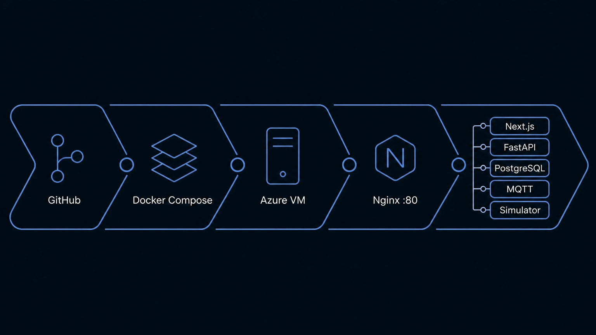

# Deployment

The live demo (**http://20.120.168.206/**) runs the full stack -
PostgreSQL, Mosquitto, backend, frontend, the DER simulator, and an
nginx reverse proxy — as containers on a single Azure VM, using the
same [`docker-compose.yml`](../docker-compose.yml) as local full-stack
testing. No separate database/migration mechanism is introduced - this
runs the project's existing Alembic migrations.

```
GitHub
  ↓
Docker Compose  (postgres, mosquitto, migrate, backend, frontend, simulator, nginx)
  ↓
Azure VM
  ↓
nginx :80
  ├── /      → frontend
  └── /api/  → backend  (including /api/v1/ws)
```

**Only port 80 (nginx) is public.** PostgreSQL, Mosquitto, the backend
(`8000`), and the frontend (`3000`) are all bound to `127.0.0.1` on the
VM — reachable for local debugging on the machine itself, never from
outside it. nginx is the single public entry point; see
[`infra/nginx/nginx.conf`](../infra/nginx/nginx.conf). HTTP only — no
TLS/certificate is configured.



## Prerequisites

- Docker Engine + Docker Compose v2 (`docker compose version`)
- Git
- Port 80 reachable from wherever you'll access the deployment

## 1. Configure environment

```bash
git clone https://github.com/ayushHardeniya/EnerFabric.git
cd EnerFabric
cp .env.example .env
```

Edit `.env` (see [`.env.example`](../.env.example) for the full list):

| Variable | Purpose |
|---|---|
| `NEXT_PUBLIC_API_URL` | Leave empty (default). The frontend then calls `/api/...` same-origin, which nginx forwards to the backend — no public IP/hostname needs to be baked into the frontend build. |
| `POSTGRES_PASSWORD` | Change from the placeholder for anything beyond a throwaway demo. |
| `HTTP_PORT` | Only change if port 80 is already in use on the host. |
| `POSTGRES_PORT` / `MOSQUITTO_PORT` / `BACKEND_PORT` / `FRONTEND_PORT` | Host-side bindings for internal services — all `127.0.0.1`-only regardless of value. |

## 2. Bring up the stack

```bash
docker compose up -d --build
# or: make deploy-up
```

This builds the backend and frontend images, starts PostgreSQL and
Mosquitto, runs the one-shot `migrate` service (`alembic upgrade head`
then `python -m app.mqtt.seed_assets` — both existing, unmodified
scripts), then starts the backend, frontend, simulator, and nginx.

```bash
docker compose ps
```

should show seven services; `migrate` shows `Exited (0)` once finished
— that's expected, it's a one-shot init step, not a long-running
service.

## 3. Verify

```bash
curl http://localhost/api/v1/assets       # backend reachable via nginx, seeded fleet present
curl http://localhost/api/v1/telemetry    # simulator telemetry flowing (wait ~10s after startup)
```

Open `http://<vm-public-ip>/` in a browser — the Overview page should
show backend/realtime status as connected, the seeded asset fleet, and
telemetry updating live as the simulator publishes.

For direct container-level debugging on the VM itself (not via nginx,
not reachable from outside the machine):

```bash
curl http://localhost:8000/health   # backend
curl -I http://localhost:3000/      # frontend
```

## Logs

```bash
docker compose logs -f              # all services
docker compose logs -f backend      # one service
docker compose logs -f migrate      # check the one-shot migration/seed step
```

## Updating

```bash
git pull
docker compose up -d --build        # rebuilds changed images, reapplies migrations, restarts
```

## Stopping

```bash
docker compose down                 # or: make deploy-down
```

```bash
docker compose down -v              # also removes the postgres_data volume — destroys the database
```

Only use `-v` deliberately - there is no backup step in this MVP's
deployment, and this cannot be undone.
